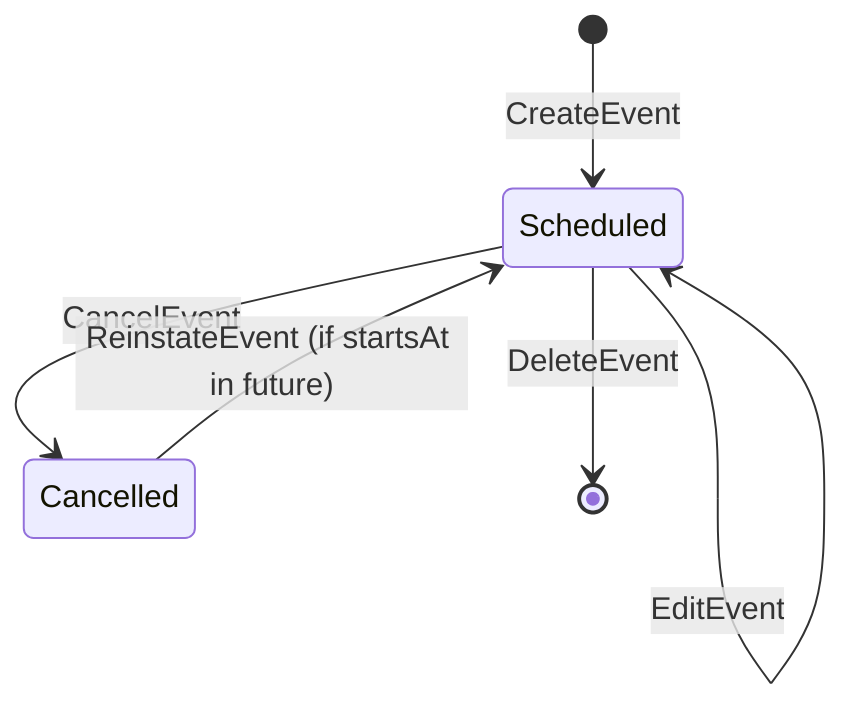

# Event Aggregate

## Purpose

A single scheduled team activity. Events are the calendar backbone of the application — all RSVP, Attendance, and GameResult data references an Event. Events support optimistic concurrency and a two-state lifecycle (`SCHEDULED` / `CANCELLED`).

## Aggregate Root

`Event`

## Entities

_(none — Event is a single entity)_

## Value Objects

- `EventType` — `GAME`, `PRACTICE`, `MEETING`, `OTHER`
- `EventStatus` — `SCHEDULED` (default) | `CANCELLED`
- `Version` — optimistic-concurrency counter; must be supplied on every write
- `OverlapWarning` — non-blocking advisory emitted when time window overlaps another Event
- `CancellationReason` — optional free-text stored on cancel

## Invariants

- `title`, `type`, `startsAt` are required; creation is rejected without them.
- `version` must match current value on PATCH or cancel; mismatch → HTTP 409.
- A `CANCELLED` Event is read-only: edits, Attendance recording, GameResult recording, and new RSVPs are all rejected (HTTP 422).
- A `CANCELLED` Event may be reinstated only if `startsAt` is in the future.
- Overlapping Events produce an `OverlapWarning` but are saved regardless.
- Events are scoped to the Team's active Season.

## Commands

| Command | Description | Emits |
|---|---|---|
| CreateEvent | Creates a new SCHEDULED Event (validates required fields; checks for overlap) | `EventCreated` |
| EditEvent | Updates title, date, time, location, or notes (requires matching version) | `EventUpdated` |
| DeleteEvent | Permanently removes the Event | `EventDeleted` |
| CancelEvent | Transitions status to CANCELLED with optional reason (requires version) | `EventCancelled` |
| ReinstateEvent | Transitions CANCELLED → SCHEDULED if startsAt is still in the future | `EventReinstated` |

## State Transitions

## Related

- [RecurringEventSeries Aggregate](recurring-event-series.md)
- [Schedule Context](../bounded-contexts/schedule.md)
- [EventCancelled Domain Event](../domain-events/event-cancelled.md)
- [EventCreated Domain Event](../domain-events/event-created.md)
- [EventUpdated Domain Event](../domain-events/event-updated.md)
- [Ubiquitous Language](../ubiquitous-language.md)
