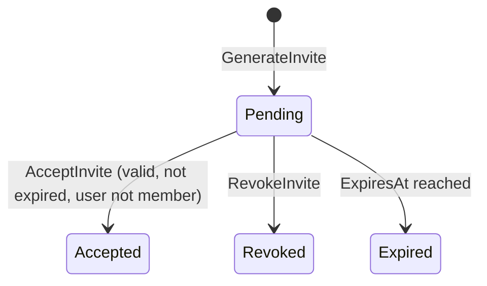

# Invite Aggregate

## Purpose

A time-limited, role-scoped token that a Coach generates to grant a registered User membership in a Team. Provides a controlled onboarding path for players and parents without opening team data to arbitrary accounts.

## Aggregate Root

`Invite`

## Entities

_(none — Invite is a single entity)_

## Value Objects

- `InviteCode` — a unique, opaque token or link fragment
- `InviteRole` — the Role granted on acceptance: `PLAYER` or `PARENT`
- `ExpiresAt` — timestamp after which the Invite is invalid
- `InviteStatus` — `PENDING` | `ACCEPTED` | `REVOKED` | `EXPIRED`

## Invariants

- Only COACH may generate an Invite.
- An Invite transitions to `EXPIRED` automatically after `ExpiresAt`.
- A `REVOKED` or `EXPIRED` or `ACCEPTED` Invite cannot be accepted.
- A User who is already a Member of the Team cannot accept a new Invite (duplicate membership rejected).
- `InviteRole` is fixed at creation; it cannot be changed after generation.

## Commands

| Command | Description | Emits |
|---|---|---|
| GenerateInvite | Creates a PENDING Invite for a given Role | `InviteCreated` |
| RevokeInvite | Invalidates a PENDING Invite before acceptance | `InviteRevoked` |
| AcceptInvite | Validates the Invite and creates a Membership | `InviteAccepted` |

## State Transitions

## Related

- [Team Aggregate](team.md)
- [Team Context](../bounded-contexts/team.md)
- [InviteAccepted Domain Event](../domain-events/invite-accepted.md)
- [Ubiquitous Language](../ubiquitous-language.md)
