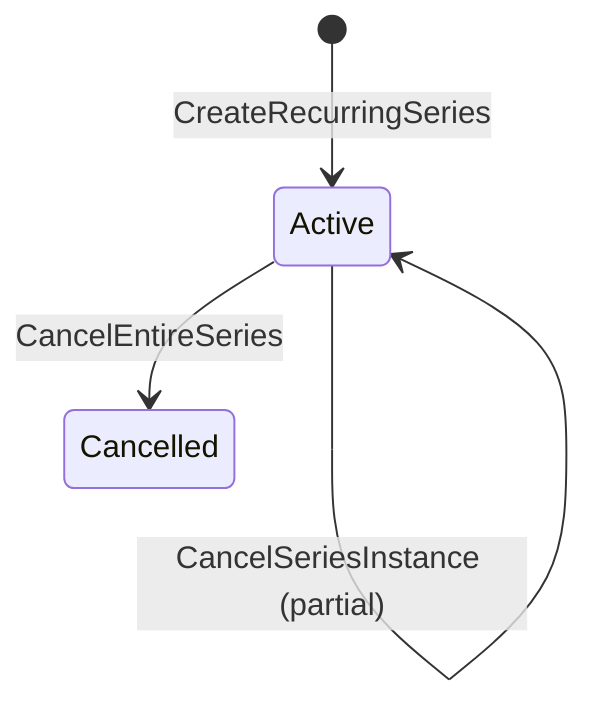

# RecurringEventSeries Aggregate

## Purpose

Defines a repeating schedule template and generates individual Event instances from it. Once generated, each instance is an independent Event that can be cancelled or edited without affecting sibling instances — unless the entire series is cancelled.

## Aggregate Root

`RecurringEventSeries`

## Entities

- `Event` (one instance per recurrence occurrence; managed by [Event aggregate](event.md))

## Value Objects

- `RecurrenceRule` — cadence (e.g., `WEEKLY`) + day-of-week + end date
- `SeriesStatus` — `ACTIVE` | `CANCELLED`

## Invariants

- All generated instances must fall within the Series' end date.
- Cancelling a single instance does not alter the Series or sibling instances.
- Cancelling the entire Series removes only future instances; past instances are preserved.

## Commands

| Command | Description | Emits |
|---|---|---|
| CreateRecurringSeries | Generates instances per RecurrenceRule and persists them as Events | `RecurringSeriesCreated` |
| CancelSeriesInstance | Cancels one Event within the Series (per [Event.CancelEvent](event.md)) | `EventCancelled` (on instance) |
| CancelEntireSeries | Cancels all future Event instances in the Series | `RecurringSeriesCancelled` |

## State Transitions

## Open Questions

- Can a coach edit the recurrence rule (end date, cadence) after creation? Not specified in BDR-006.
- Are individual instances editable independently of the Series template? BDR-006 only specifies cancellation of individual instances.

## Related

- [Event Aggregate](event.md)
- [Schedule Context](../bounded-contexts/schedule.md)
- [Ubiquitous Language](../ubiquitous-language.md)
