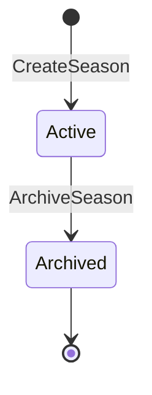

# Season Aggregate

## Purpose

Scopes a Team's Events, GameResults, and Season Record to a discrete named date range. Archiving a Season preserves its history as read-only and allows a fresh Season to start from 0–0–0.

## Aggregate Root

`Season`

## Entities

- `SeasonRecord` — aggregate win/loss/tie counts for this Season

## Value Objects

- `SeasonName` — non-blank string identifier
- `DateRange` — start and end dates (inclusive)
- `SeasonStatus` — `ACTIVE` or `ARCHIVED`

## Invariants

- A Team may have at most one `ACTIVE` Season at a time.
- An `ARCHIVED` Season is read-only; no Events or GameResults may be added.
- SeasonRecord is isolated per Season; it resets to 0–0–0 when a new Season is created.

## Commands

| Command | Description | Emits |
|---|---|---|
| CreateSeason | Creates a new Season and marks it ACTIVE (fails if one already ACTIVE) | `SeasonCreated` |
| ArchiveSeason | Transitions the ACTIVE Season to ARCHIVED | `SeasonArchived` |

## State Transitions

## Related

- [Team Aggregate](team.md)
- [Team Context](../bounded-contexts/team.md)
- [Ubiquitous Language](../ubiquitous-language.md)
