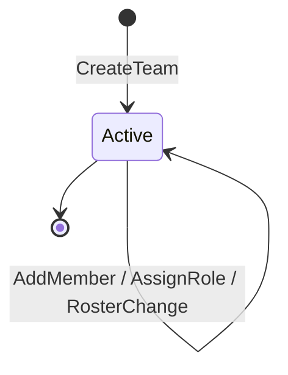

# Team Aggregate

## Purpose

The central organizing unit of the application. A Team owns its Memberships, Roster, Seasons, and Invites. All other feature data (Events, Results, Announcements) is scoped to a Team.

## Aggregate Root

`Team`

## Entities

- `Membership` — a User's role within this Team
- `RosterEntry` — a Player's profile within this Team
- `Season` — a named date range owned by this Team (see also [Season aggregate](season.md))
- `Invite` — a pending invitation to join this Team

## Value Objects

- `TeamName` — 1–100 Unicode characters; unique per owner (case-insensitive)
- `Role` — `COACH` | `ASSISTANT_COACH` | `TEAM_MANAGER` | `SCOREKEEPER` | `PLAYER` | `PARENT`

## Invariants

- Team name must be unique for the creating User (case-insensitive).
- A User may have only one Membership per Team.
- Exactly one Season may be `ACTIVE` at a time per Team.
- A RosterEntry may appear at most once per Team.
- The creator is always assigned `COACH` role on creation.

## Commands

| Command | Description | Emits |
|---|---|---|
| CreateTeam | Creates a new Team and assigns COACH to creator | `TeamCreated` |
| AssignRole | Changes a Member's Role (coach-only) | `MemberRoleAssigned` |
| AddRosterEntry | Adds a Player profile to the Roster | `PlayerAddedToRoster` |
| UpdateRosterEntry | Updates jersey number, position, or name | `PlayerRosterEntryUpdated` |
| LinkParentToPlayer | Associates a Parent Member with a RosterEntry | `ParentLinkedToPlayer` |
| GenerateInvite | Creates a time-limited invite for a given Role | `InviteCreated` |
| RevokeInvite | Invalidates a pending Invite | `InviteRevoked` |
| AcceptInvite | Adds the accepting User as a Member | `InviteAccepted` |
| CreateSeason | Creates and activates a new Season | `SeasonCreated` |
| ArchiveSeason | Transitions the active Season to archived | `SeasonArchived` |

## State Transitions

## Related

- [Team Context](../bounded-contexts/team.md)
- [Season Aggregate](season.md)
- [Membership Aggregate](membership.md)
- [Invite Aggregate](invite.md)
- [Ubiquitous Language](../ubiquitous-language.md)
