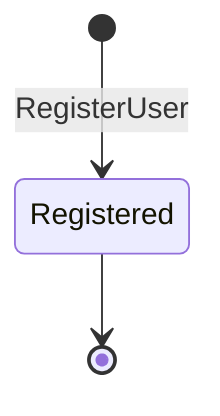

# User Aggregate

## Purpose

Represents a registered identity in the system. A User owns credentials and nothing else — all team-specific data lives in other aggregates scoped to a Team.

## Aggregate Root

`User`

## Entities

_(none — User is a single entity)_

## Value Objects

- `Email` — unique, case-insensitive; validated at creation
- `HashedPassword` — opaque credential; never returned in responses

## Invariants

- Email must be unique across all Users (case-insensitive).
- Password must meet minimum length before the account is persisted.

## Commands

| Command | Description | Emits |
|---|---|---|
| RegisterUser | Creates a new User from email + password | `UserRegistered` |
| AuthenticateUser | Validates credentials; issues session | _(no domain event)_ |

## State Transitions

## Open Questions

- Is email verification (confirm via link) in scope? BDR-001 does not require it.
- Password reset / account recovery flow not yet specified.

## Related

- [Identity Context](../bounded-contexts/identity.md)
- [Ubiquitous Language](../ubiquitous-language.md)
