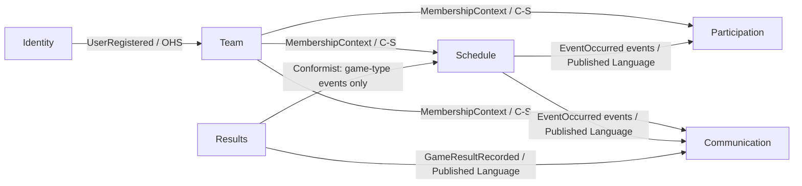

# Context Map

## Relationships

| Upstream | Downstream | Pattern | Contract |
|---|---|---|---|
| Identity | Team | Open Host Service | `UserRegistered` event; downstream resolves User by ID |
| Team | Schedule | Customer / Supplier | Team supplies Season scope and role-based write authorization to Schedule |
| Team | Participation | Customer / Supplier | Team supplies Membership and Roster data for RSVP and Attendance |
| Team | Communication | Customer / Supplier | Team supplies Membership and targeting data for Announcements and Notifications |
| Schedule | Participation | Published Language | `EventCreated`, `EventUpdated`, `EventCancelled` govern RSVP validity and Attendance eligibility |
| Schedule | Communication | Published Language | `EventUpdated`, `EventCancelled`, `EventReinstated` trigger member Notifications |
| Results | Communication | Published Language | `GameResultRecorded` triggers member Notifications |
| Results | Schedule | Conformist | Results may only be recorded for `GAME`-type Events; Results conforms to Schedule's Event model |
